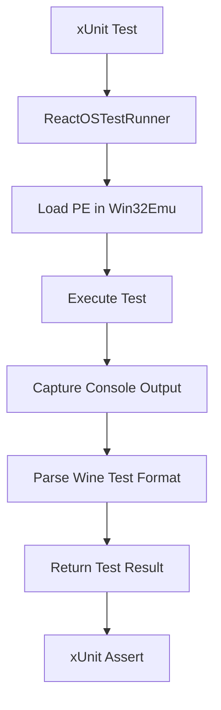

# ReactOS Test Integration Research

**Date:** 2025-12-08  
**Issue:** https://github.com/archanox/Win32Emu/issues/[TBD]  
**ReactOS Tests:** https://github.com/reactos/reactos/tree/master/modules/rostests

## Executive Summary

ReactOS provides a comprehensive test suite for Win32 APIs in `modules/rostests/apitests`. These tests can be used to validate Win32Emu's module implementations. This document analyzes the ReactOS test structure and proposes integration strategies.

## ReactOS Test Structure

### Test Organization

ReactOS tests are organized by DLL module:
- `apitests/kernel32/` - Kernel32.dll API tests (~60 test files)
- `apitests/user32/` - User32.dll API tests (~80 test files)
- `apitests/gdi32/` - GDI32.dll API tests
- `apitests/advapi32/` - AdvAPI32.dll API tests
- `apitests/shell32/` - Shell32.dll API tests
- And many more...

Each test is a C source file that tests one or more related API functions.

### Test Framework

ReactOS tests use the **Wine Test Framework**, which is:
- **C-based**: Tests are written in C, compiled to Win32 PE executables
- **Self-contained**: Each test is a standalone executable
- **Macro-based**: Uses macros like `ok()`, `skip()`, `trace()`, `todo_wine`
- **LGPL Licensed**: Compatible with Win32Emu's license

Key macros:
```c
ok(condition, "message", ...);       // Assert with formatted message
skip("reason");                       // Skip test with reason
win_skip("reason");                   // Skip on Windows (Wine-specific)
trace("message", ...);                // Debug trace output
todo_wine { ... }                     // Known Wine incompatibilities
START_TEST(name) { ... }              // Define test entry point
```

### Test Structure Example

From `kernel32/GetModuleFileName.c`:
```c
#include "precomp.h"

static VOID TestGetModuleFileNameA(VOID)
{
    CHAR Buffer[MAX_PATH];
    DWORD Length;
    
    Length = GetModuleFileNameA(NULL, Buffer, sizeof(Buffer));
    ok(Length != 0, "Length = %lu\n", Length);
    ok(Length < sizeof(Buffer), "Length = %lu\n", Length);
    ok(Buffer[Length] == 0, "Buffer not null terminated\n");
}

START_TEST(GetModuleFileName)
{
    TestGetModuleFileNameA();
    TestGetModuleFileNameW();
}
```

## Integration Strategies

### Strategy 1: PE Executable Runner (RECOMMENDED)

**Approach:** Run ReactOS test executables directly in Win32Emu

**Pros:**
- ✅ No code conversion needed
- ✅ Tests remain maintained by ReactOS
- ✅ Validates full emulator stack (PE loading, API emulation, CPU)
- ✅ Easy to add new tests (just copy/compile PE)
- ✅ Can be automated in CI/CD

**Cons:**
- ⚠️ Requires compiling ReactOS tests to PE executables
- ⚠️ Needs test result parser for Wine test output format
- ⚠️ May expose emulator bugs unrelated to API implementation

**Implementation:**
1. Compile ReactOS tests to Win32 PE executables (can use MinGW or MSVC)
2. Create test runner that:
   - Loads PE executable in Win32Emu
   - Captures console output
   - Parses Wine test result format
   - Reports results to xUnit
3. Integrate with existing test infrastructure

**Example:**
```csharp
[Fact]
[Trait("Category", "ReactOSTests")]
[Trait("Module", "Kernel32")]
public void ReactOS_Kernel32_GetModuleFileName()
{
    var result = ReactOSTestRunner.Run(
        "rostests/kernel32_GetModuleFileName.exe"
    );
    Assert.True(result.AllPassed, result.Summary);
}
```

### Strategy 2: C# Test Conversion

**Approach:** Convert ReactOS tests to C# xUnit tests

**Pros:**
- ✅ Native C# tests
- ✅ Better IDE integration
- ✅ Direct API testing without PE loading overhead
- ✅ Easier debugging

**Cons:**
- ❌ Manual conversion required for each test
- ❌ Tests become stale (don't track ReactOS updates)
- ❌ Significant upfront work
- ❌ Doesn't test PE loading

**Implementation:**
1. Manually or semi-automatically convert C tests to C#
2. Replace Wine macros with xUnit assertions
3. Maintain converted tests separately

**Not recommended** due to maintenance burden.

### Strategy 3: Reference Suite

**Approach:** Document ReactOS tests as external reference, don't integrate

**Pros:**
- ✅ No integration work needed
- ✅ Tests maintained by ReactOS

**Cons:**
- ❌ Requires manual test execution
- ❌ No automation possible
- ❌ No CI/CD integration
- ❌ Easy to forget to run tests

**Not recommended** - doesn't meet the goal of using tests for validation.

### Strategy 4: Hybrid Approach

**Approach:** Combine Strategy 1 (PE runner) with selective Strategy 2 (conversion)

**Implementation:**
1. Use PE runner as default for all ReactOS tests
2. Convert specific high-value tests to C# for:
   - Core APIs that need frequent testing
   - Tests that are frequently failing (for easier debugging)
   - APIs under active development
3. Mark converted tests with trait linking to original ReactOS test

**Pros:**
- ✅ Best of both worlds
- ✅ Flexibility for different use cases
- ✅ Can prioritize conversion effort

**Cons:**
- ⚠️ More complex to maintain
- ⚠️ May lead to duplication

## Recommended Approach: Strategy 1 (PE Executable Runner)

### Implementation Plan

#### Phase 1: Infrastructure (Week 1)
1. **Create `Win32Emu.Tests.ReactOS` project**
   - xUnit test project
   - References Win32Emu.Emulator
   - Trait: `Category=ReactOSTests` (optional, non-blocking in CI)

2. **Implement `ReactOSTestRunner` class**
   ```csharp
   public class ReactOSTestRunner
   {
       public static ReactOSTestResult Run(string peExecutablePath);
       private static void ParseWineTestOutput(string output);
   }
   ```

3. **Implement Wine test output parser**
   - Parse lines like: `kernel32_test.c:123: Test failed: message`
   - Track: passes, failures, skips, todos
   - Generate xUnit-compatible summary

#### Phase 2: Test Compilation (Week 2)
1. **Setup ReactOS test compilation**
   - Option A: Use MinGW cross-compiler on Linux
   - Option B: Use MSVC on Windows
   - Option C: Download pre-compiled ReactOS test executables

2. **Create build scripts**
   - Script to compile specific test modules
   - Store compiled PEs in `tests/reactos/` directory
   - `.gitignore` compiled binaries (too large for git)

3. **Document compilation process**
   - Add `docs/guides/REACTOS_TEST_COMPILATION.md`
   - Include build prerequisites
   - Provide step-by-step instructions

#### Phase 3: Initial Integration (Week 3)
1. **Add tests for Kernel32 module**
   - Start with simple tests (GetVersion, GetModuleFileName)
   - Validate runner works correctly
   - Fix any emulator issues discovered

2. **Add tests for User32 module**
   - Window management tests
   - Message handling tests

3. **Document test results**
   - Track which tests pass/fail
   - Identify gaps in Win32Emu implementation

#### Phase 4: CI/CD Integration (Week 4)
1. **Add to CI pipeline**
   - Mark as optional tests (non-blocking)
   - Run on PRs for visibility
   - Report results but don't fail build

2. **Create test result dashboard**
   - Track progress over time
   - Visualize API coverage

## Test Execution Flow



## Wine Test Output Format

ReactOS tests output in this format:
```
kernel32_test.c:123: Test succeeded inside todo block: message
kernel32_test.c:456: Test failed: expected X, got Y
kernel32_test.c:789: Tests skipped: reason
Summary: 45 tests executed (43 passed, 2 failed, 0 skipped)
```

Parser needs to handle:
- File:line references
- Pass/fail/skip/todo indicators
- Summary line
- Error messages

## Benefits for Win32Emu

1. **Validation**: Proves API implementations match Windows behavior
2. **Coverage**: Tests edge cases developers might miss
3. **Regression Prevention**: Catch breaks in existing functionality
4. **Documentation**: Tests show expected API behavior
5. **Community**: Leverage ReactOS's testing investment
6. **Completeness**: Tests validate entire API surface

## Licensing

- **ReactOS Tests**: GPL/LGPL (compatible with Win32Emu)
- **Wine Test Framework**: LGPL 2.1+
- **Attribution**: Must credit ReactOS project
- **Modification**: Can modify tests if needed

## Potential Challenges

### Challenge 1: Test Compilation
**Issue:** Compiling ReactOS tests requires build environment  
**Solution:** Provide Docker container with build tools, or use pre-compiled binaries

### Challenge 2: Test Failures
**Issue:** Many tests may initially fail due to unimplemented APIs  
**Solution:** Mark as optional in CI, track failures, prioritize fixes

### Challenge 3: Output Parsing
**Issue:** Wine test output format may vary  
**Solution:** Robust parser with error handling, log unparseable output

### Challenge 4: Performance
**Issue:** Running many PE executables may be slow  
**Solution:** Parallelize test execution, cache results, run subset in PR

### Challenge 5: Test Dependencies
**Issue:** Some tests may depend on filesystem, registry, etc.  
**Solution:** Setup test environment with required dependencies

## Success Metrics

- **Coverage**: % of ReactOS tests passing in Win32Emu
- **Module Completeness**: Which DLL modules have passing tests
- **Regression Rate**: How often do passing tests start failing
- **Bug Discovery**: Number of emulator bugs found via tests

## Example Test Implementation

```csharp
namespace Win32Emu.Tests.ReactOS;

[Trait("Category", "ReactOSTests")]
[Trait("Category", "DllModuleTests")]  // Optional in CI
public class Kernel32ReactOSTests
{
    [Fact]
    [Trait("Module", "Kernel32")]
    [Trait("Function", "GetModuleFileName")]
    public void GetModuleFileName_ReactOSTest()
    {
        var result = ReactOSTestRunner.Run(
            "tests/reactos/kernel32_GetModuleFileName.exe"
        );
        
        Assert.True(
            result.AllPassed, 
            $"ReactOS test failed:\n{result.Summary}\n{result.Output}"
        );
    }
    
    [Fact]
    [Trait("Module", "Kernel32")]
    [Trait("Function", "GetVersion")]
    public void GetVersion_ReactOSTest()
    {
        var result = ReactOSTestRunner.Run(
            "tests/reactos/kernel32_GetVersion.exe"
        );
        
        Assert.True(result.AllPassed, result.Summary);
    }
}
```

## Next Steps

1. **Create proof-of-concept**: Implement runner for 1-2 simple tests
2. **Validate approach**: Ensure it works with Win32Emu architecture
3. **Gather feedback**: Get input from maintainers
4. **Execute plan**: Follow 4-phase implementation plan
5. **Iterate**: Improve based on results

## References

- [ReactOS Test Suite](https://github.com/reactos/reactos/tree/master/modules/rostests)
- [Wine Test Framework](https://wiki.winehq.org/Wine_Testing_Framework)
- [Wine Test API](https://github.com/wine-mirror/wine/blob/master/include/wine/test.h)
- [ReactOS API Tests README](https://github.com/reactos/reactos/blob/master/modules/rostests/apitests/README.md)

## Conclusion

**Recommendation:** Implement Strategy 1 (PE Executable Runner) as it provides the best balance of:
- Validation coverage
- Maintenance burden
- Integration simplicity
- Community leverage

This approach allows Win32Emu to benefit from ReactOS's extensive test suite while maintaining flexibility for future enhancements.
